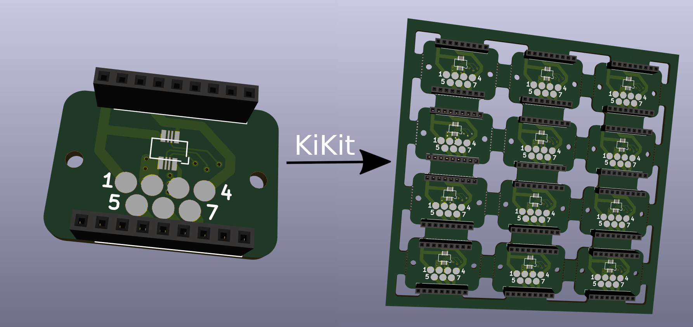

# KiKit - Automatization for KiCAD

KiKit is a Python library and CLI tool to automate several task in standard
KiCAD workflow like:

- panelization of the boards
- exporting manufacturing data



## Installation

KiKit is available as a [PyPi package](https://pypi.org/project/KiKit/), therefore, you can install it via pip:

```
pip3 install kikit
```

## Why Should I Use It?

Everything KiKit does can be also done via Pcbnew in KiCAD. But you have to do
it manually. One of the common scenarios is creation of panels. Most of the
tutorials on the internet guide you to use the "append board" functionality of
Pcbnew. However, this approach labour-intensive, error-prone and whenever you
change the board, you have to do it again.

With KiKit you just call a CLI command if you have a simple layout (e.g., grid)
or write few Python instructions like "place board here", "add bridge here",
"separate boards via mouse bites/v-cuts" and you are done. The process is
repeatable and actually much simpler than hand-drawing the panels. KiKit also
allows you to easily export all the Gerbers in a single step.

You can then write a Makefile and simply call `make` to get all your
manufacturing data.


See [BatteryPack](https://github.com/RoboticsBrno/RB0002-BatteryPack) as an
example usage of KiKit.

## Feature List

- create panels by appending boards and pieces of substrate (bridges)
- easily create mouse-bites/V-CUTS
- compared to hand-creation of panels, your panels will pass DRC (as tracks from
  different instances of the same board have distinct nets when using KiKit)
- if you have multiple boards in a single file, you can split them
- automated export of gerber files

## How To Use It?

Read the [CLI documentation](doc/cli.md) and the [panelize
documentation](doc/panelize.md).
