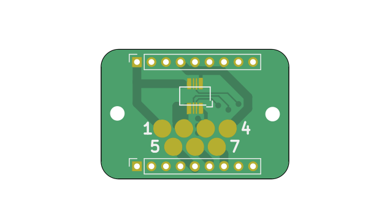
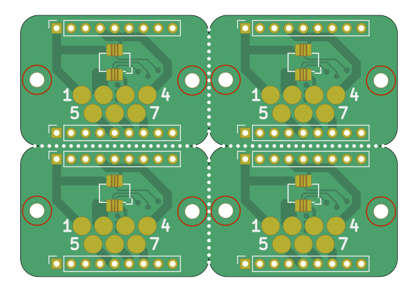
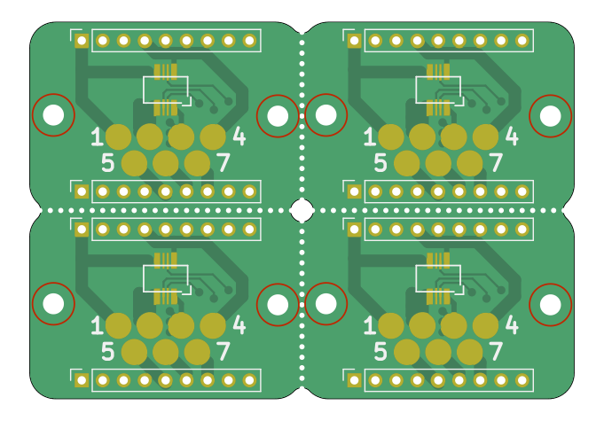
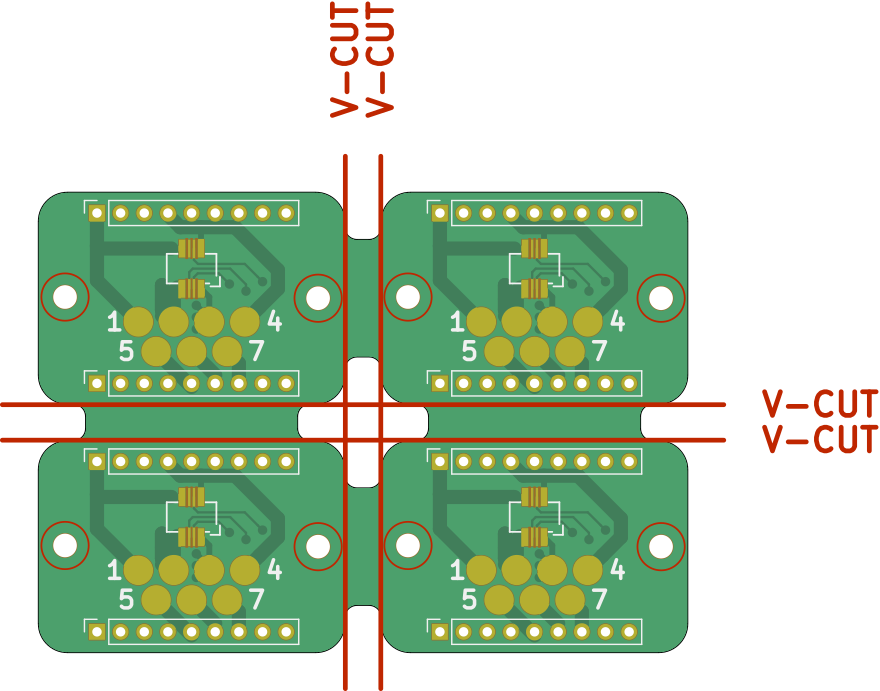
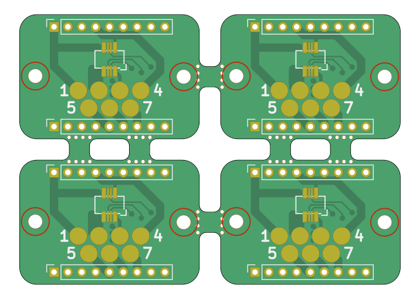
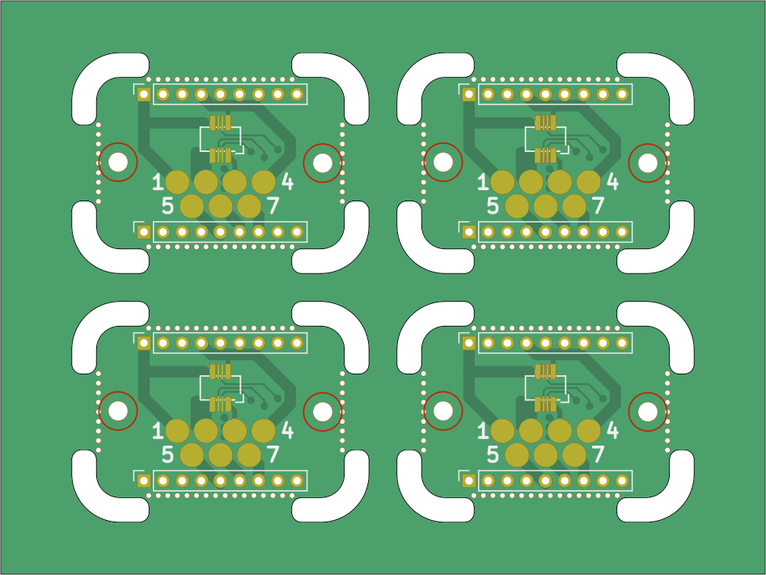
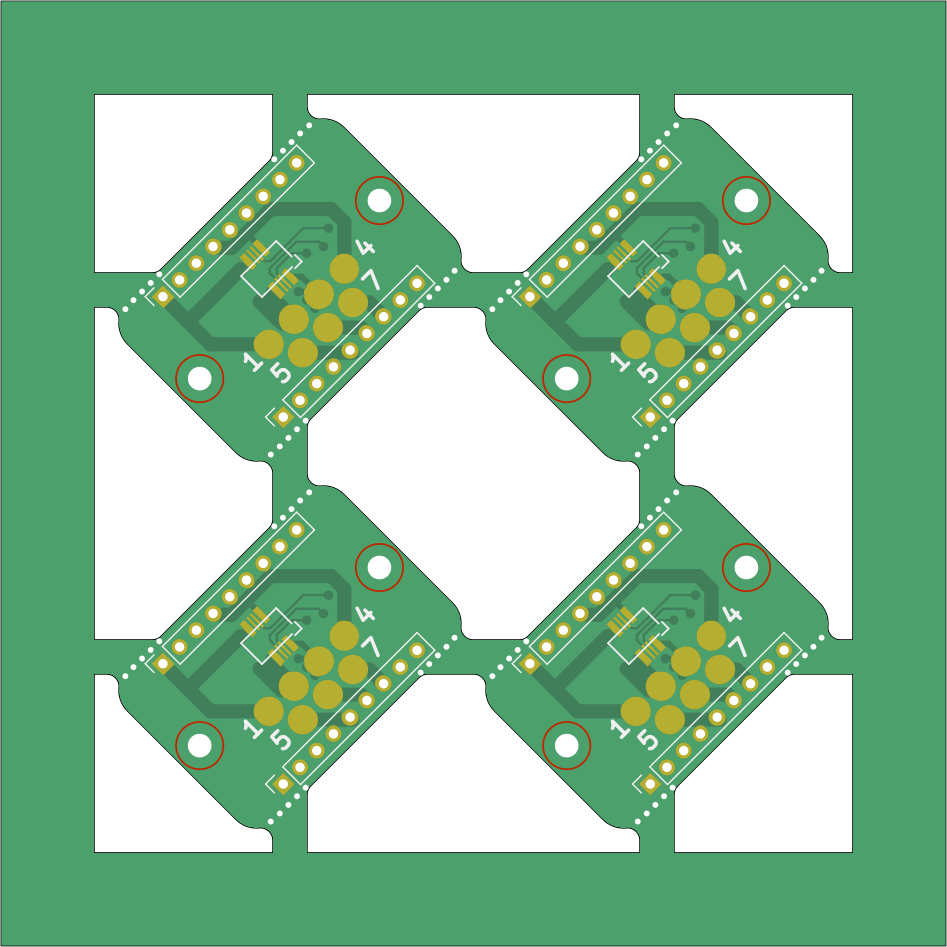
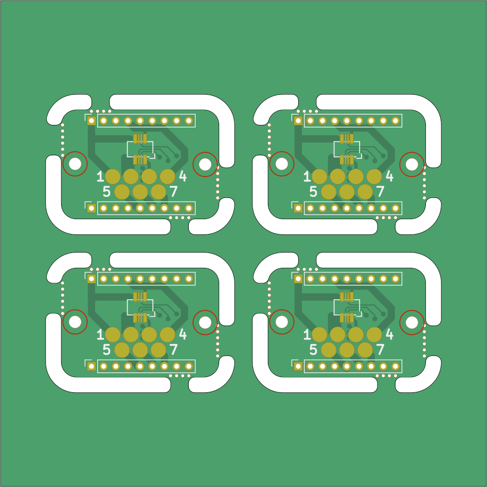
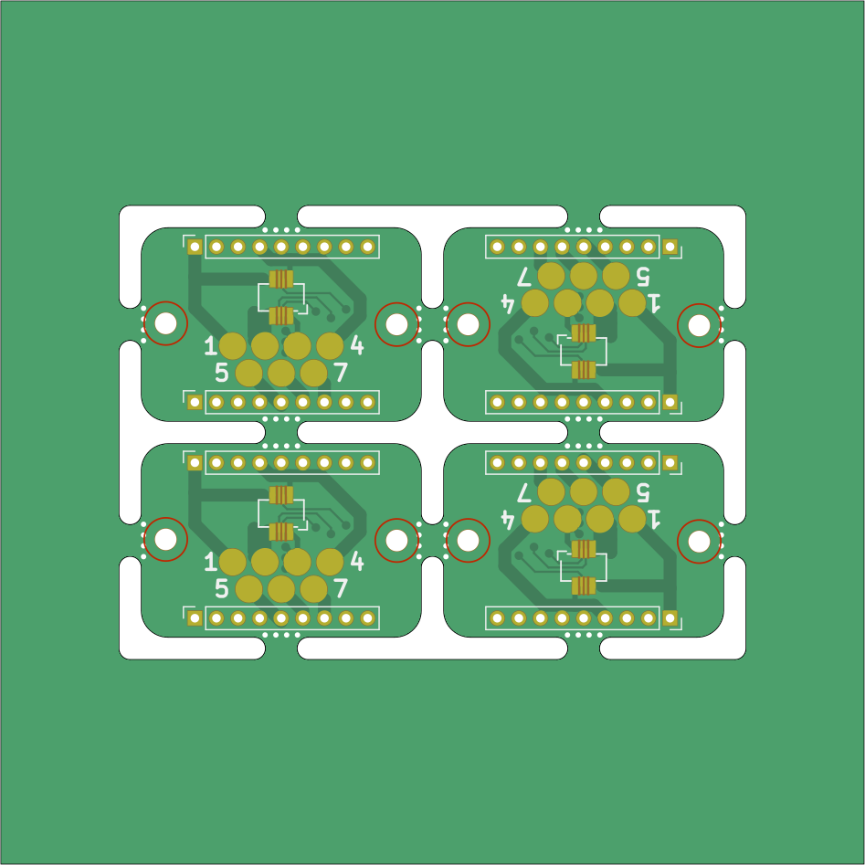

# Examples

This document will show you several examples of KiKit CLI for panelization. We
will show everything on a single board located in
`doc/resources/conn.kicad_pcb`. The board looks like this:



# Extract Board

The simples command is `extractboard`. By calling:

```
kikit panelize extractboard --sourcearea 100 50 100 100 doc/resources/conn.kicad_pcb output.kicad_pcb
```

We extract our board into a new file. This command is usefull when you designed
multiple boards in a single file (e.g., to have shared schematic for board
sandwiches). The `sourcearea` is given as a rectangle. You should specify X, Y
coordinates of upper left corner width and height in millimeters. Also note,
that only board items which fully fit inside this rectangle are extracted.


# Panelize

Let's start with our first panel.

```
kikit panelize grid --gridsize 2 2 --vcuts doc/resources/conn.kicad_pcb panel.kicad_pcb
```


We specified that we want 2x2 panel, no space between board and separate them by
V-cuts. Note, that due to the rounded corners, this panel cannot be
manufactured. We will fix it later.

One side note - if you try it with your own board some components might be gone.
KiKit respects the KiCAD component selection criteria. When you specify an input
rectangle, only the components that **fully fit** inside the input rectangle are
selected. This however take in account **both name and value labels** (even when
they are hidden).

When you do not specify the source are explicitly, KiKit takes the board outline
bounding box as the source area. Therefore, by default, components outside the
board substrate are not copied to panel.

Note that this is intended behavior; for once it is consistent with KiCAD
behavior of user selection and also it allows to easily ignore surrounding
comments and drawings in the board sheet (it makes no sense to have 12 same
copies of the notes around the board).

How to include the missing components?
- specify the source area explicitly to include all your components
- specify `--tolerance 10` to enlarge the board outline bounding box by e.g. 10
  mm. The default value is 5 mm.

Now back to our example. Let's see how the same panel will look like with mouse
bites instead:

```
kikit panelize grid --gridsize 2 2 --mousebites 0.5 1 0 doc/resources/conn.kicad_pcb panel.kicad_pcb
```


You specify mouse bites by three numbers - hole diameter, hole spacing and
offset. All in millimeters. We use offset 0, because we have no tabs. Otherwise
the recommended value is 0.25 mm.

The approach shown above is good for boards without rounded corners. If send
panel above for fabrication we would obtain something like this:

```
kikit panelize grid --gridsize 2 2 --mousebites 0.5 1 0 --radius 1 doc/resources/conn.kicad_pcb panel.kicad_pcb
```


The `--radius` argument simulates the milling operation. You specify mill radius
(usuall the smallest diameter is 2 mm). We recommend to use the radius argument.
See the distorted corners in picture above? Let's fix it by adding tabs.

```
kikit panelize grid --space 3 --gridsize 2 2 --tabwidth 18 --tabheight 10 --vcuts --radius 1 doc/resources/conn.kicad_pcb panel.kicad_pcb
```


We introduced tabs - extra space between the board. We also specified the tab
width and height, so there is clearance for milling the corners.

When doing similar panel with mousebites, you usually want shorter tabs and
possibly more of them. We can do it by specifing `--htabs` and `--vtabs`:

```
kikit panelize grid --space 3 --gridsize 2 2 --tabwidth 3 --tabheight 3 --htabs 1 --vtabs 2 --mousebites 0.5 1 0.25 --radius 1 doc/resources/conn.kicad_pcb panel.kicad_pcb
```


If you want, you can also add a frame around the panel via `--panelsize`. Panel
size takes width and height in millimeters. This works both with mousebites and
V-cuts.

```
kikit panelize grid --space 3 --gridsize 2 2 --tabwidth 18 --tabheight 10 --vcuts --radius 1 --panelsize 70 55 doc/resources/conn.kicad_pcb panel.kicad_pcb
```


This was the `grid` command. There is also command `tightgrid` which works
similarly, but instead of adding tabs and frames around the board, in places a
full frame around the boards and mills a slot around the contours. Why this
might be useful? For example when you make panel out of circular boards which
you want to separate by V-cuts (by cutting a little bit to their interior). In
that case don't forget to specify `--vcutcurves` to approximate curvature cuts
via a straight V-cut. Back to `tightgrid`:

```
kikit panelize tightgrid --slotwidth 2.5 --space 8 --gridsize 2 2 --tabwidth 15 --tabheight 8 --mousebites 0.5 1 0.25 --radius 1 --panelsize 80 60 doc/resources/conn.kicad_pcb panel.kicad_pcb
```


You can also rotate the input board. Might not be usefull for
rectangular boards, but if you have a circular or oddly shaped board...

```
kikit panelize grid --space 2 --gridsize 2 2 --tabwidth 3 --tabheight 3 --mousebites 0.5 1 0.25 --radius 1 --panelsize 80 80 --rotation 45 doc/resources/conn.kicad_pcb panel.kicad_pcb
```


Sometimes you might find yourself in a need for precise tab placement. This can be
easily done. Just draw a line in one of KiCAD layers (be careful, the
orientation matters - the line has to target the board substrate) and specify
option `--tabsfrom`. Don't forget to disable automatically generated tabs by
specifying `--vtabs 0` and `--htabs 0`. See for yourself, there are some lines
already prepared for you in `conn.kicad_pcb`

```
kikit panelize tightgrid --slotwidth 2.5 --space 8 --gridsize 2 2 --htabs 0 --vtabs 0 --tabsfrom Eco2.User 3 --tabsfrom Eco1.User 5 --mousebites 0.5 1 0.25 --radius 1 --panelsize 80 80 doc/resources/conn.kicad_pcb panel.kicad_pcb
```


Especially when you work with flex PCBs it makes sense to leave copper on
non-functional parts of the panel to make it stiffer. It might also make sense
to leave on traditional PCBs as it reduces the amount of etching. To do so,
simply specify `--copperfill`. Here is one of the examples above with a copper
fill:

```
kikit panelize grid --space 3 --gridsize 2 2 --tabwidth 18 --tabheight 10 --vcuts --radius 1 --panelsize 70 55 --copperfill doc/resources/conn.kicad_pcb panel.kicad_pcb
```

