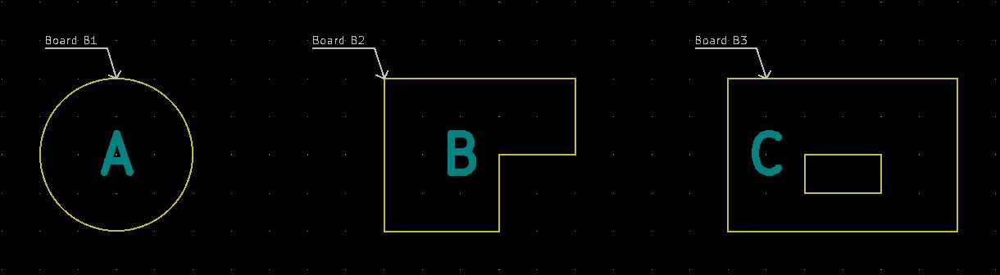

## Multi-board workflow with KiKit

KiCAD does not support multiple board per project, nor boards with shared
schematics. However, with the following workflow, you can easily draw multiple
boards with shared schematics and, e.g., easily ensure that tha board connectors
match.

The workflow is the following:

First, draw a separate schematics sheet for each of your boards and propagate
the pins on the inter-board connectors. E.g., in one of my project it looks like
this:


I also place the corresponding connectors next to each other to illustrate that
they connect. Then draw your board schematics as usual - with one exception.
**Do not use global power symbols nor global labels**, use only local labels.
This ensures that the power lines are separate for each board and DRC won't
complain, that you have not connected the power between two board.

Then, draw all your boards into a single board file side-by-side. See file
[resources/multiboard.kicad_pcb](resources/multiboard.kicad_pcb) for a dead
simple illustration. You can also draw lines that will help you align your
boards' connectors.

Before manufacturing, use KiKit to extract the boards into a separate board
files via the `extract` command.

This can be done in two ways:

- via bounding box selection
- via annotation

We will show how to use it on
[resources/multiboard.kicad_pcb](resources/multiboard.kicad_pcb) which looks
like this:




## Bounding box selection

Simply specify the top left and bottom right corner. Everything that fits fully
inside it, will be included in the board. The command for separation of board A
into a separate board file is:

```
kikit separate --source 'rectangle; tlx: 89mm; tly: 89mm; brx: 111mm; bry: 111mm' \
        multiboard.kicad_pcb board_a.kicad_pcb
```

After that, `board_a.kicad_pcb` will contain only a board A. Note that the `\`
is there for shell as we split our command into two lines.

## Annotation

As you can see, the source file contains an annotation in the form of virtual
footprints `kikit:Board`. You can place them into your document so that the
arrow points to the board edge. Than you can use the reference of the annotation
symbol for separation of the board. To separate board A simply invoke:

```
kikit separate --source 'annotation; ref: B1' \
    multiboard.kicad_pcb board_a.kicad_pcb
```

After that, `board_a.kicad_pcb` will contain only a board A. Note that the `\`
is there for shell as we split our command into two lines.

## About panelization

Note that if panelize your boards, you don't have to separate your boards first;
just use the `--source` with the panelization command.

## Preserving annotations

When you use the separate command, KiKit preserves all annotations within the
source bounding box. If you would like to strip the annotations, you can specify
`--stripAnnotation` and KiKit will remove all annotations from the resulting
board.
