# Examples

This document will show you several examples of KiKit CLI for panelization. Note
that this is **not an exhaustive description** of everything that KiKit can do,
nor proper documentation. For further details, please refer to:

- [description of all panelization options](cli.md)
- [more detail about KiKit's algorithm for tab creation](tabs.md)
- [reference for the Python interface](python_api.md)

We will show everything on a single board located in
[`docs/resources/conn.kicad_pcb`](https://raw.githubusercontent.com/yaqwsx/KiKit/master/docs/resources/conn.kicad_pcb). The board looks like this when rendered via
PcbDraw:


## Basic panels & layout

Let's start with our first panel.

!!! example "Panelization command"

    === "Linux/macOS"
        ```
        kikit panelize \
            --layout 'grid; rows: 2; cols: 2;' \
            --tabs full \
            --cuts vcuts \
            docs/resources/conn.kicad_pcb panel.kicad_pcb
        ```

    === "Windows"
        ```
        kikit panelize ^
            --layout "grid; rows: 2; cols: 2;" ^
            --tabs full ^
            --cuts vcuts ^
            docs/resources/conn.kicad_pcb panel.kicad_pcb
        ```

    

We specified that we want 2x2 panel, no space between board and separate them by
V-cuts. We also specified that we want to build full tabs (although no tabs are
visible in this example). This is ,however, essential – if we omitted tabs, no
cuts between the boards would be performed. Note, that due to the rounded
corners, this panel cannot be manufactured. We will fix it later.

Note that the `\` in the input is there to make shell happy, so we can break our
command into multiple lines. Also note that there are single quotes around the
key-value pair – again, to make shell happy and to interpret a string with
spaces as a single option.

Note that **on Windows you have the enter the commands into KiCAD Command
Prompt** instead of the regular Command Prompt. You can find it under the Start
menu.

Also note that KiKit accepts all options in categories (e.g., `layout`, `tabs`,
`cuts`, ...). You can specify the parameters as a semicolon-separated key-value
list. To learn about the precise syntax of the CLI and about all options, please
refer to – [documentation](cli.md).

One side note – if you try it with your own board some components might be gone.
KiKit respects the KiCAD component selection criteria. When you specify an input
rectangle, only the components that **fully fit** inside the input rectangle are
selected. This however take in account **both name and value labels** (even when
they are hidden).

When you do not specify the source are explicitly, KiKit takes the board outline
bounding box as the source area. Therefore, by default, components outside the
board substrate are not copied to panel.

Note that this is intended behavior; for once it is consistent with KiCAD
behavior of user selection and also it allows to easily ignore surrounding
comments and drawings in the board sheet (it makes no sense to have 12 same
copies of the notes around the board).

How to include the missing components?
- specify the source area explicitly to include all your components
- specify `--source 'tolerance: 10mm'` to enlarge the board outline bounding box
  by e.g. 10 mm. The default value is 1 mm.

I told you that the panel above is not suitable for manufacturing. Let's see
why:

!!! example "Panelization command"

    === "Linux/macOS"
        ```
        kikit panelize \
            --layout 'grid; rows: 2; cols: 2;' \
            --tabs full \
            --cuts vcuts \
            --post 'millradius: 1mm' \
            docs/resources/conn.kicad_pcb panel.kicad_pcb
        ```

    === "Windows"
        ```
        kikit panelize ^
            --layout "grid; rows: 2; cols: 2;" ^
            --tabs full ^
            --cuts vcuts ^
            --post "millradius: 1mm" ^
            docs/resources/conn.kicad_pcb panel.kicad_pcb
        ```

    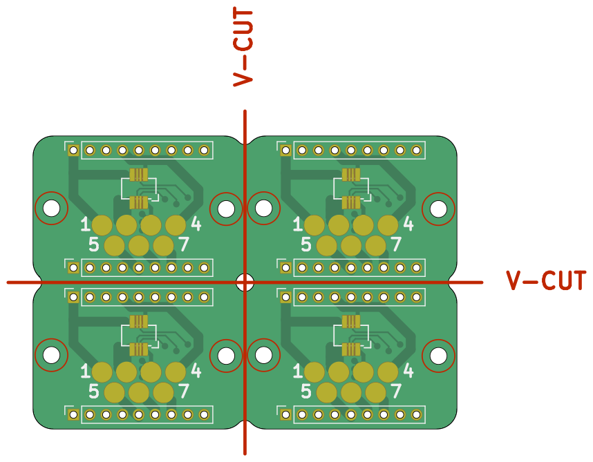

We specified a milling simulation post-processing. This simulates the milling
operation in the fab house. As you can see, the sharp internal corners cannot be
manufactured. I recommend you to use milling postprocessing always – you can
easily see if your cuts are off or you have too narrow slots in your design.

Usually, one would use full tabs only for rectangular boards. Usually, when you
have rounded corners, you will use short tabs instead and add some space between
the boards. So let's fix it:

!!! example "Panelization command"

    === "Linux/macOS"
        ```
        kikit panelize \
            --layout 'grid; rows: 2; cols: 2; space: 2mm' \
            --tabs 'fixed; hwidth: 10mm; vwidth: 15mm' \
            --cuts vcuts \
            --post 'millradius: 1mm' \
            docs/resources/conn.kicad_pcb panel.kicad_pcb
        ```

    === "Windows"
        ```
        kikit panelize ^
            --layout "grid; rows: 2; cols: 2; space: 2mm" ^
            --tabs "fixed; hwidth: 10mm; vwidth: 15mm" ^
            --cuts vcuts ^
            --post "millradius: 1mm" ^
            docs/resources/conn.kicad_pcb panel.kicad_pcb
        ```

    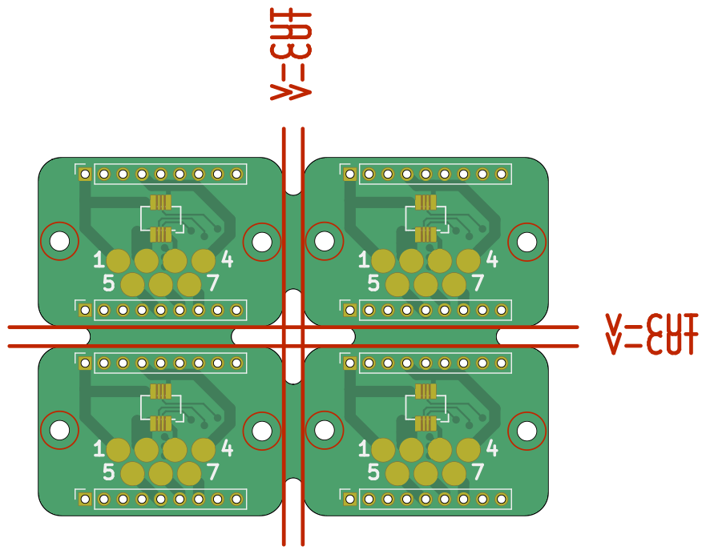

In that way, the rounded corners can be machined. Lets' see the same example
with mousebites instead:

!!! example "Panelization command"

    === "Linux/macOS"
        ```
        kikit panelize \
            --layout 'grid; rows: 2; cols: 2; space: 2mm' \
            --tabs 'fixed; width: 5mm' \
            --cuts 'mousebites; drill: 0.5mm; spacing: 1mm; offset: 0.2mm' \
            docs/resources/conn.kicad_pcb panel.kicad_pcb
        ```

    === "Windows"
        ```
        kikit panelize ^
            --layout "grid; rows: 2; cols: 2; space: 2mm" ^
            --tabs "fixed; width: 5mm" ^
            --cuts "mousebites; drill: 0.5mm; spacing: 1mm; offset: 0.2mm" ^
            docs/resources/conn.kicad_pcb panel.kicad_pcb
        ```

    

We changed cut type to mousebites and we specified that they should be
performed by 0.5mm holes with a spacing of 1 mm. You could also use inches if
you want – just specify `<number>in. Since we use mousebites, we used narrower
tabs. We also specified that the cuts should be inset 0.25 mm into the board
outline. This is suitable when your board should fit into a cover – when you
break away the tabs, all burs will be inside the intended board outline.


What happens, when we simulate the milling operation?

!!! example "Panelization command"

    === "Linux/macOS"
        ```
        kikit panelize \
            --layout 'grid; rows: 2; cols: 2; space: 2mm' \
            --tabs 'fixed; width: 5mm' \
            --cuts 'mousebites; drill: 0.5mm; spacing: 1mm; offset: 0.2mm' \
            --post 'millradius: 1mm' \
            docs/resources/conn.kicad_pcb panel.kicad_pcb
        ```

    === "Windows"
        ```
        kikit panelize ^
            --layout "grid; rows: 2; cols: 2; space: 2mm" ^
            --tabs "fixed; width: 5mm" ^
            --cuts "mousebites; drill: 0.5mm; spacing: 1mm; offset: 0.2mm" ^
            --post "millradius: 1mm" ^
            docs/resources/conn.kicad_pcb panel.kicad_pcb
        ```

    

See? The cuts are somewhat short. This is due to the internal corners that
cannot be milled. KiKit can fix that for you – just specify you want to prolong
your cuts tangentially by a small amount:

!!! example "Panelization command"

    === "Linux/macOS"
        ```
        kikit panelize \
            --layout 'grid; rows: 2; cols: 2; space: 2mm' \
            --tabs 'fixed; width: 3mm' \
            --cuts 'mousebites; drill: 0.5mm; spacing: 1mm; offset: 0.2mm; prolong: 0.5mm' \
            --post 'millradius: 1mm' \
            docs/resources/conn.kicad_pcb panel.kicad_pcb
        ```

    === "Windows"
        ```
        kikit panelize ^
            --layout "grid; rows: 2; cols: 2; space: 2mm" ^
            --tabs "fixed; width: 3mm" ^
            --cuts "mousebites; drill: 0.5mm; spacing: 1mm; offset: 0.2mm; prolong: 0.5mm" ^
            --post "millradius: 1mm" ^
            docs/resources/conn.kicad_pcb panel.kicad_pcb
        ```

    

If you want, you can also specify a number of tabs to generate. KiKit will place
them evenly:

!!! example "Panelization command"

    === "Linux/macOS"
        ```
        kikit panelize \
            --layout 'grid; rows: 2; cols: 2; space: 2mm' \
            --tabs 'fixed; width: 3mm; vcount: 2' \
            --cuts 'mousebites; drill: 0.5mm; spacing: 1mm; offset: 0.2mm; prolong: 0.5mm' \
            --post 'millradius: 1mm' \
            docs/resources/conn.kicad_pcb panel.kicad_pcb
        ```

    === "Windows"
        ```
        kikit panelize ^
            --layout "grid; rows: 2; cols: 2; space: 2mm" ^
            --tabs "fixed; width: 3mm; vcount: 2" ^
            --cuts "mousebites; drill: 0.5mm; spacing: 1mm; offset: 0.2mm; prolong: 0.5mm" ^
            --post "millradius: 1mm" ^
            docs/resources/conn.kicad_pcb panel.kicad_pcb
        ```

    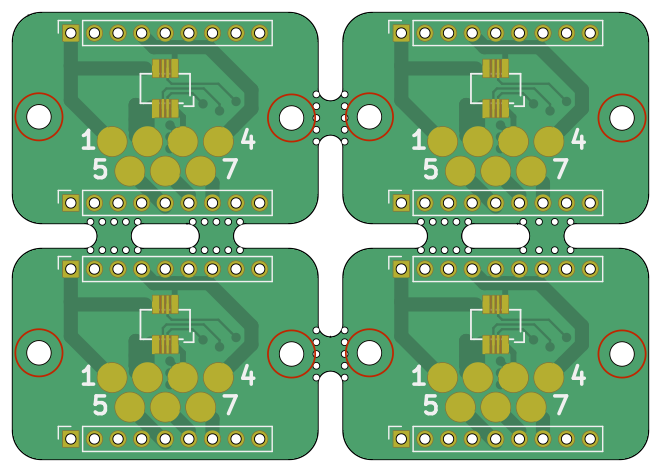

You can also append frame or rails to the panel. Frames and rail are useful in
the following situations:

- you want to assemble your board, so you need tooling holes, fiducial.
- you want to append a text to board (e.g., to identify a manufacturing batch)
- your boards are not rectangluar and you want to use V-Cuts (most manufactures
  require the outer edge of the panel to be a rectangle in order to manufacture
  V-Cuts)

Let's start with rails:

!!! example "Panelization command"

    === "Linux/macOS"
        ```
        kikit panelize \
            --layout 'grid; rows: 2; cols: 2; space: 2mm' \
            --tabs 'fixed; width: 3mm; vcount: 2' \
            --cuts 'mousebites; drill: 0.5mm; spacing: 1mm; offset: 0.2mm; prolong: 0.5mm' \
            --framing 'railstb; width: 5mm; space: 3mm;' \
            --post 'millradius: 1mm' \
            docs/resources/conn.kicad_pcb panel.kicad_pcb
        ```

    === "Windows"
        ```
        kikit panelize ^
            --layout "grid; rows: 2; cols: 2; space: 2mm" ^
            --tabs "fixed; width: 3mm; vcount: 2" ^
            --cuts "mousebites; drill: 0.5mm; spacing: 1mm; offset: 0.2mm; prolong: 0.5mm" ^
            --framing "railstb; width: 5mm; space: 3mm;" ^
            --post "millradius: 1mm" ^
            docs/resources/conn.kicad_pcb panel.kicad_pcb
        ```

    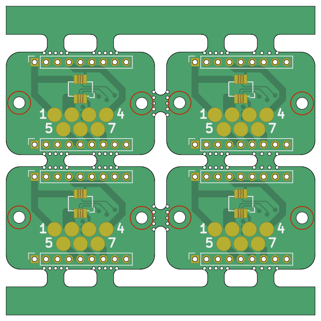

Similarly, you can add left and right rail via the `railslr` type. If you want
a full frame, use the type `frame`. When you place a full frame, it might make
sense to include cuts in the corner of the frame, so you can break it apart
easily. Let's see an example:

!!! example "Panelization command"

    === "Linux/macOS"
        ```
        kikit panelize \
            --layout 'grid; rows: 2; cols: 2; space: 2mm' \
            --tabs 'fixed; width: 3mm; vcount: 2' \
            --cuts 'mousebites; drill: 0.5mm; spacing: 1mm; offset: 0.2mm; prolong: 0.5mm' \
            --framing 'frame; width: 5mm; space: 3mm; cuts: both' \
            --post 'millradius: 1mm' \
            docs/resources/conn.kicad_pcb panel.kicad_pcb
        ```

    === "Windows"
        ```
        kikit panelize ^
            --layout "grid; rows: 2; cols: 2; space: 2mm" ^
            --tabs "fixed; width: 3mm; vcount: 2" ^
            --cuts "mousebites; drill: 0.5mm; spacing: 1mm; offset: 0.2mm; prolong: 0.5mm" ^
            --framing "frame; width: 5mm; space: 3mm; cuts: both" ^
            --post "millradius: 1mm" ^
            docs/resources/conn.kicad_pcb panel.kicad_pcb
        ```

    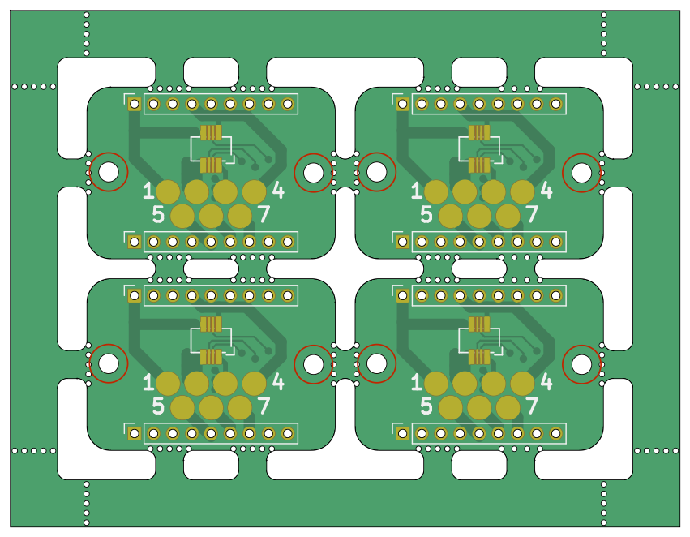

Note that you can also use just only a vertical or horizontal frame cuts:

!!! example "Panelization command"

    === "Linux/macOS"
        ```
        kikit panelize \
            --layout 'grid; rows: 2; cols: 2; space: 2mm' \
            --tabs 'fixed; width: 3mm; vcount: 2' \
            --cuts 'mousebites; drill: 0.5mm; spacing: 1mm; offset: 0.2mm; prolong: 0.5mm' \
            --framing 'frame; width: 5mm; space: 3mm; cuts: h' \
            --post 'millradius: 1mm' \
            docs/resources/conn.kicad_pcb panel.kicad_pcb
        ```

    === "Windows"
        ```
        kikit panelize ^
            --layout "grid; rows: 2; cols: 2; space: 2mm" ^
            --tabs "fixed; width: 3mm; vcount: 2" ^
            --cuts "mousebites; drill: 0.5mm; spacing: 1mm; offset: 0.2mm; prolong: 0.5mm" ^
            --framing "frame; width: 5mm; space: 3mm; cuts: h" ^
            --post "millradius: 1mm" ^
            docs/resources/conn.kicad_pcb panel.kicad_pcb
        ```

    

When you use V-cuts it might make sense to not remove all material, but only
mill a slot around the board of the board. This yields a stronger panel – and
some manufacturers require such style for assembly with V-Cuts. This is achieved
via framing type `tightframe`. Note that it does not make much sense with
mousebites.

!!! example "Panelization command"

    === "Linux/macOS"
        ```
        kikit panelize \
            --layout 'grid; rows: 2; cols: 2; space: 6mm' \
            --tabs 'fixed; width: 3mm; vcount: 2' \
            --cuts vcuts \
            --framing 'tightframe; width: 5mm; space: 3mm; ' \
            --post 'millradius: 1mm' \
            docs/resources/conn.kicad_pcb panel.kicad_pcb
        ```

    === "Windows"
        ```
        kikit panelize ^
            --layout "grid; rows: 2; cols: 2; space: 6mm" ^
            --tabs "fixed; width: 3mm; vcount: 2" ^
            --cuts vcuts ^
            --framing "tightframe; width: 5mm; space: 3mm; " ^
            --post "millradius: 1mm" ^
            docs/resources/conn.kicad_pcb panel.kicad_pcb
        ```

    

Once we have a frame, we can append a tooling holes, fiducials and some text to
it:

!!! example "Panelization command"

    === "Linux/macOS"
        ```
        kikit panelize \
            --layout 'grid; rows: 2; cols: 2; space: 2mm' \
            --tabs 'fixed; width: 3mm; vcount: 2' \
            --cuts 'mousebites; drill: 0.5mm; spacing: 1mm; offset: 0.2mm; prolong: 0.5mm' \
            --framing 'railstb; width: 5mm; space: 3mm;' \
            --tooling '3hole; hoffset: 2.5mm; voffset: 2.5mm; size: 1.5mm' \
            --fiducials '3fid; hoffset: 5mm; voffset: 2.5mm; coppersize: 2mm; opening: 1mm;' \
            --text 'simple; text: yaqwsx's panel; anchor: mt; voffset: 2.5mm; hjustify: center; vjustify: center;' \
            --post 'millradius: 1mm' \
            docs/resources/conn.kicad_pcb panel.kicad_pcb
        ```

    === "Windows"
        ```
        kikit panelize ^
            --layout "grid; rows: 2; cols: 2; space: 2mm" ^
            --tabs "fixed; width: 3mm; vcount: 2" ^
            --cuts "mousebites; drill: 0.5mm; spacing: 1mm; offset: 0.2mm; prolong: 0.5mm" ^
            --framing "railstb; width: 5mm; space: 3mm;" ^
            --tooling "3hole; hoffset: 2.5mm; voffset: 2.5mm; size: 1.5mm" ^
            --fiducials "3fid; hoffset: 5mm; voffset: 2.5mm; coppersize: 2mm; opening: 1mm;" ^
            --text "simple; text: yaqwsx's panel; anchor: mt; voffset: 2.5mm; hjustify: center; vjustify: center;" ^
            --post "millradius: 1mm" ^
            docs/resources/conn.kicad_pcb panel.kicad_pcb
        ```

    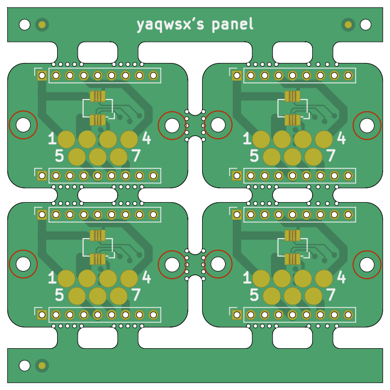

If you want to add text to both rails, you can use section `--text2` to add a
second text. You can also use variables enclosed in curly brackets (`{}`). The
list of supported variables is listed in the documentation. Also, plugins can
introduce new variables.

!!! example "Panelization command"

    === "Linux/macOS"
        ```
        kikit panelize \
            --layout 'grid; rows: 2; cols: 2; space: 2mm' \
            --tabs 'fixed; width: 3mm; vcount: 2' \
            --cuts 'mousebites; drill: 0.5mm; spacing: 1mm; offset: 0.2mm; prolong: 0.5mm' \
            --framing 'railstb; width: 5mm; space: 3mm;' \
            --tooling '3hole; hoffset: 2.5mm; voffset: 2.5mm; size: 1.5mm' \
            --fiducials '3fid; hoffset: 5mm; voffset: 2.5mm; coppersize: 2mm; opening: 1mm;' \
            --text 'simple; text: yaqwsx's panel; anchor: mt; voffset: 2.5mm; hjustify: center; vjustify: center;' \
            --text2 'simple; text: Created on {date}; anchor: mb; voffset: -2.5mm; hjustify: center; vjustify: center;' \
            --post 'millradius: 1mm' \
            docs/resources/conn.kicad_pcb panel.kicad_pcb
        ```

    === "Windows"
        ```
        kikit panelize ^
            --layout "grid; rows: 2; cols: 2; space: 2mm" ^
            --tabs "fixed; width: 3mm; vcount: 2" ^
            --cuts "mousebites; drill: 0.5mm; spacing: 1mm; offset: 0.2mm; prolong: 0.5mm" ^
            --framing "railstb; width: 5mm; space: 3mm;" ^
            --tooling "3hole; hoffset: 2.5mm; voffset: 2.5mm; size: 1.5mm" ^
            --fiducials "3fid; hoffset: 5mm; voffset: 2.5mm; coppersize: 2mm; opening: 1mm;" ^
            --text "simple; text: yaqwsx's panel; anchor: mt; voffset: 2.5mm; hjustify: center; vjustify: center;" ^
            --text2 "simple; text: Created on {date}; anchor: mb; voffset: -2.5mm; hjustify: center; vjustify: center;" ^
            --post "millradius: 1mm" ^
            docs/resources/conn.kicad_pcb panel.kicad_pcb
        ```

    

There are many options for text and fiducials. Be sure to read the [full
documentation](cli.md).

If you have an automatic feeder in your PNP machine or you just dislike
sharp corners, you can add a chamfer or a fillet to the panel frame/rails:

!!! example "Panelization command"

    === "Linux/macOS"
        ```
        kikit panelize \
            --layout 'grid; rows: 2; cols: 2; space: 2mm' \
            --tabs 'fixed; width: 3mm; vcount: 2' \
            --cuts 'mousebites; drill: 0.5mm; spacing: 1mm; offset: 0.2mm; prolong: 0.5mm' \
            --framing 'railstb; width: 5mm; space: 3mm; fillet: 1mm' \
            --tooling '3hole; hoffset: 2.5mm; voffset: 2.5mm; size: 1.5mm' \
            --fiducials '3fid; hoffset: 5mm; voffset: 2.5mm; coppersize: 2mm; opening: 1mm;' \
            --post 'millradius: 1mm' \
            docs/resources/conn.kicad_pcb panel.kicad_pcb
        ```

    === "Windows"
        ```
        kikit panelize ^
            --layout "grid; rows: 2; cols: 2; space: 2mm" ^
            --tabs "fixed; width: 3mm; vcount: 2" ^
            --cuts "mousebites; drill: 0.5mm; spacing: 1mm; offset: 0.2mm; prolong: 0.5mm" ^
            --framing "railstb; width: 5mm; space: 3mm; fillet: 1mm" ^
            --tooling "3hole; hoffset: 2.5mm; voffset: 2.5mm; size: 1.5mm" ^
            --fiducials "3fid; hoffset: 5mm; voffset: 2.5mm; coppersize: 2mm; opening: 1mm;" ^
            --post "millradius: 1mm" ^
            docs/resources/conn.kicad_pcb panel.kicad_pcb
        ```

    
!!! example "Panelization command"

    === "Linux/macOS"
        ```
        kikit panelize \
            --layout 'grid; rows: 2; cols: 2; space: 2mm' \
            --tabs 'fixed; width: 3mm; vcount: 2' \
            --cuts 'mousebites; drill: 0.5mm; spacing: 1mm; offset: 0.2mm; prolong: 0.5mm' \
            --framing 'railstb; width: 5mm; space: 3mm; chamfer: 1mm' \
            --tooling '3hole; hoffset: 2.5mm; voffset: 2.5mm; size: 1.5mm' \
            --fiducials '3fid; hoffset: 5mm; voffset: 2.5mm; coppersize: 2mm; opening: 1mm;' \
            --post 'millradius: 1mm' \
            docs/resources/conn.kicad_pcb panel.kicad_pcb
        ```

    === "Windows"
        ```
        kikit panelize ^
            --layout "grid; rows: 2; cols: 2; space: 2mm" ^
            --tabs "fixed; width: 3mm; vcount: 2" ^
            --cuts "mousebites; drill: 0.5mm; spacing: 1mm; offset: 0.2mm; prolong: 0.5mm" ^
            --framing "railstb; width: 5mm; space: 3mm; chamfer: 1mm" ^
            --tooling "3hole; hoffset: 2.5mm; voffset: 2.5mm; size: 1.5mm" ^
            --fiducials "3fid; hoffset: 5mm; voffset: 2.5mm; coppersize: 2mm; opening: 1mm;" ^
            --post "millradius: 1mm" ^
            docs/resources/conn.kicad_pcb panel.kicad_pcb
        ```

    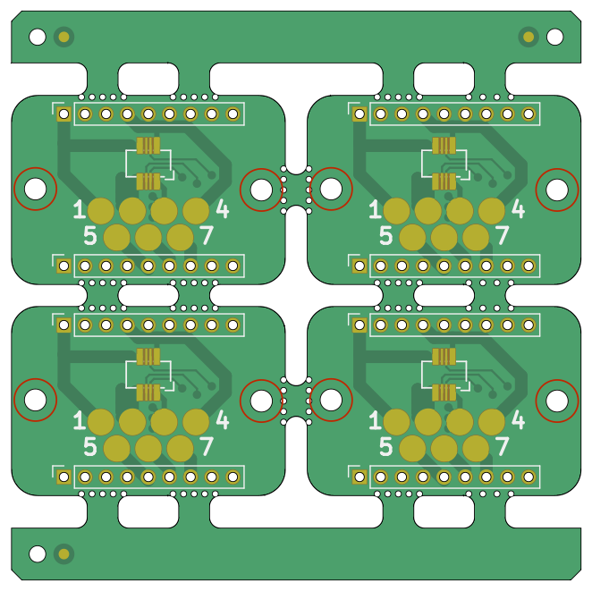

Some services, e.g., JLC PCB require a minimal panel size. If you want to ensure
that your panel meets the criteria, you can specify minimal total width/height
of the panel. Let's see an example:

!!! example "Panelization command"

    === "Linux/macOS"
        ```
        kikit panelize \
            --layout 'grid; rows: 2; cols: 2; space: 2mm' \
            --tabs 'fixed; width: 3mm; vcount: 2' \
            --cuts 'mousebites; drill: 0.5mm; spacing: 1mm; offset: 0.2mm; prolong: 0.5mm' \
            --framing 'frame; width: 5mm; space: 3mm; mintotalheight: 100mm; mintotalwidth: 100mm' \
            --tooling '3hole; hoffset: 2.5mm; voffset: 2.5mm; size: 1.5mm' \
            --fiducials '3fid; hoffset: 5mm; voffset: 2.5mm; coppersize: 2mm; opening: 1mm;' \
            --text 'simple; text: yaqwsx's panel with minimal dimensions; anchor: mt; voffset: 2.5mm; hjustify: center; vjustify: center;' \
            --post 'millradius: 1mm' \
            docs/resources/conn.kicad_pcb panel.kicad_pcb
        ```

    === "Windows"
        ```
        kikit panelize ^
            --layout "grid; rows: 2; cols: 2; space: 2mm" ^
            --tabs "fixed; width: 3mm; vcount: 2" ^
            --cuts "mousebites; drill: 0.5mm; spacing: 1mm; offset: 0.2mm; prolong: 0.5mm" ^
            --framing "frame; width: 5mm; space: 3mm; mintotalheight: 100mm; mintotalwidth: 100mm" ^
            --tooling "3hole; hoffset: 2.5mm; voffset: 2.5mm; size: 1.5mm" ^
            --fiducials "3fid; hoffset: 5mm; voffset: 2.5mm; coppersize: 2mm; opening: 1mm;" ^
            --text "simple; text: yaqwsx's panel with minimal dimensions; anchor: mt; voffset: 2.5mm; hjustify: center; vjustify: center;" ^
            --post "millradius: 1mm" ^
            docs/resources/conn.kicad_pcb panel.kicad_pcb
        ```

    

## Advanced features & layouts

It is possible that you have some critical features you want to avoid with tabs.
KiKit has several features that can help you. Let's start with the simple ones.

First, you can rotate the boards in your layout. This might make not much sense
for rectanglar boards, but it might save you when you have circular or oddly
shaped boards:


!!! example "Panelization command"

    === "Linux/macOS"
        ```
        kikit panelize \
            --layout 'grid; rows: 2; cols: 2; space: 0mm; rotation: 45deg;' \
            --tabs 'fixed; width: 3mm;' \
            --cuts 'mousebites; drill: 0.5mm; spacing: 1mm; offset: 0.2mm; prolong: 0.75mm' \
            --framing 'frame; width: 5mm; space: 3mm; cuts: both' \
            --post 'millradius: 1mm' \
            docs/resources/conn.kicad_pcb panel.kicad_pcb
        ```

    === "Windows"
        ```
        kikit panelize ^
            --layout "grid; rows: 2; cols: 2; space: 0mm; rotation: 45deg;" ^
            --tabs "fixed; width: 3mm;" ^
            --cuts "mousebites; drill: 0.5mm; spacing: 1mm; offset: 0.2mm; prolong: 0.75mm" ^
            --framing "frame; width: 5mm; space: 3mm; cuts: both" ^
            --post "millradius: 1mm" ^
            docs/resources/conn.kicad_pcb panel.kicad_pcb
        ```

    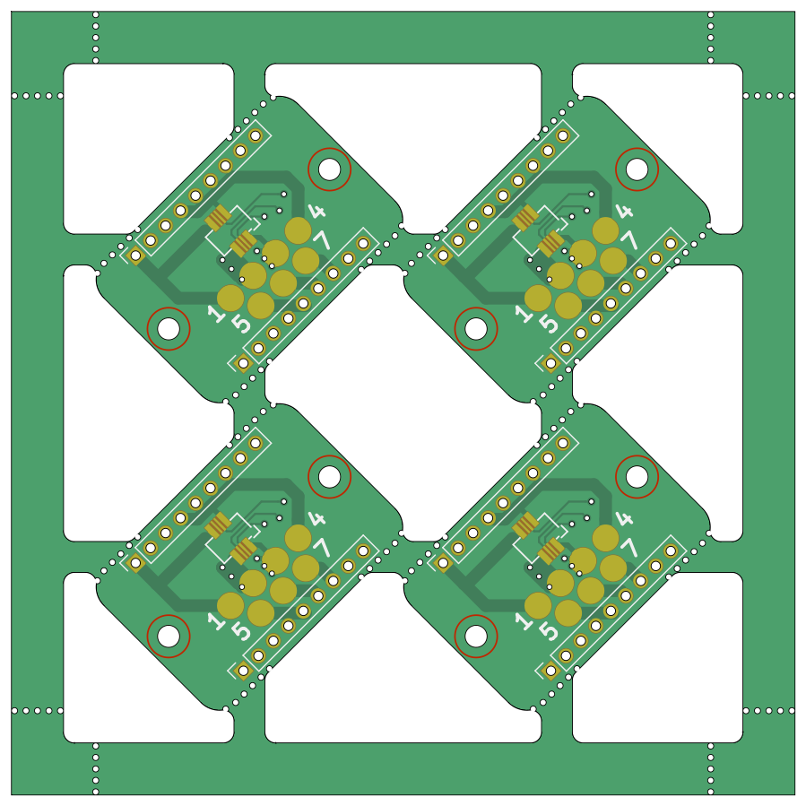

When your board has a connector sticking one one side of the board, it makes
sense to rotate the boards every other column, row or combination of both. KiKit
supports this via layout option `alternation`. You should be careful about
component references when rotating boards – KiCAD's references have a property
"Stay upright" which makes them always face up (even when placed on a panel). So
be sure to turn it off before panelizing. Here's an example:

!!! example "Panelization command"

    === "Linux/macOS"
        ```
        kikit panelize \
            --layout 'grid; rows: 2; cols: 2; space: 3mm; alternation: cols;' \
            --tabs 'fixed; width: 3mm; vcount: 2' \
            --cuts 'mousebites; drill: 0.5mm; spacing: 1mm; offset: 0.2mm; prolong: 0.5mm' \
            --framing 'frame; width: 5mm; space: 3mm; cuts: both' \
            --post 'millradius: 1mm' \
            docs/resources/conn.kicad_pcb panel.kicad_pcb
        ```

    === "Windows"
        ```
        kikit panelize ^
            --layout "grid; rows: 2; cols: 2; space: 3mm; alternation: cols;" ^
            --tabs "fixed; width: 3mm; vcount: 2" ^
            --cuts "mousebites; drill: 0.5mm; spacing: 1mm; offset: 0.2mm; prolong: 0.5mm" ^
            --framing "frame; width: 5mm; space: 3mm; cuts: both" ^
            --post "millradius: 1mm" ^
            docs/resources/conn.kicad_pcb panel.kicad_pcb
        ```

    

Another solution might be to not put tabs on, e.g., vertical edges of the PCB.
However, in that case your panel might be weak for further assembly. You can
make it more stiff by including backbones – a full piece of substrate between
the panels. You can add either vertical, horizontal or both backbones.
Also, similarly with frames, you can put cuts on your backbone to make
depanelization of your boards easier. Enough theory, let's see an example

!!! example "Panelization command"

    === "Linux/macOS"
        ```
        kikit panelize \
            --layout 'grid; rows: 2; cols: 2; space: 2mm; hbackbone: 5mm; hbonecut: true' \
            --tabs 'fixed; width: 3mm; vcount: 2; hcount: 0' \
            --cuts 'mousebites; drill: 0.5mm; spacing: 1mm; offset: 0.2mm; prolong: 0.5mm' \
            --framing 'railstb; width: 5mm; space: 3mm;' \
            --post 'millradius: 1mm' \
            docs/resources/conn.kicad_pcb panel.kicad_pcb
        ```

    === "Windows"
        ```
        kikit panelize ^
            --layout "grid; rows: 2; cols: 2; space: 2mm; hbackbone: 5mm; hbonecut: true" ^
            --tabs "fixed; width: 3mm; vcount: 2; hcount: 0" ^
            --cuts "mousebites; drill: 0.5mm; spacing: 1mm; offset: 0.2mm; prolong: 0.5mm" ^
            --framing "railstb; width: 5mm; space: 3mm;" ^
            --post "millradius: 1mm" ^
            docs/resources/conn.kicad_pcb panel.kicad_pcb
        ```

    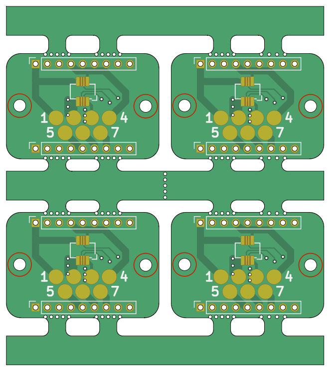

Often, not all backbones are needed. Especially for larger panels. Therefore, if
you want, you can skip some of them. Consider the following 4×4 panel with only
ever other backbone:

!!! example "Panelization command"

    === "Linux/macOS"
        ```
        kikit panelize \
            --layout 'grid; rows: 4; cols: 4; space: 2mm; hbackbone: 5mm; vbackbone: 5mm; hboneskip: 1; vboneskip: 1' \
            --tabs 'fixed; width: 3mm; vcount: 2; hcount: 0' \
            --cuts 'mousebites; drill: 0.5mm; spacing: 1mm; offset: 0.2mm; prolong: 0.5mm' \
            --framing 'railstb; width: 5mm; space: 3mm;' \
            --post 'millradius: 1mm' \
            docs/resources/conn.kicad_pcb panel.kicad_pcb
        ```

    === "Windows"
        ```
        kikit panelize ^
            --layout "grid; rows: 4; cols: 4; space: 2mm; hbackbone: 5mm; vbackbone: 5mm; hboneskip: 1; vboneskip: 1" ^
            --tabs "fixed; width: 3mm; vcount: 2; hcount: 0" ^
            --cuts "mousebites; drill: 0.5mm; spacing: 1mm; offset: 0.2mm; prolong: 0.5mm" ^
            --framing "railstb; width: 5mm; space: 3mm;" ^
            --post "millradius: 1mm" ^
            docs/resources/conn.kicad_pcb panel.kicad_pcb
        ```

    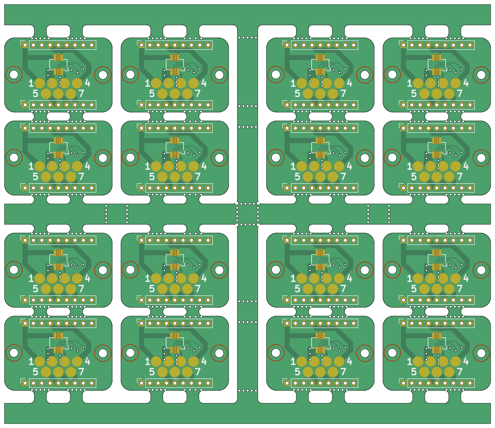

The most powerful feature of KiKit regarding tab placement are tabs via
annotation. Remember our test board? When you open it in Pcbnew, you can see
that there are some special footprints – KiKit's annotations:

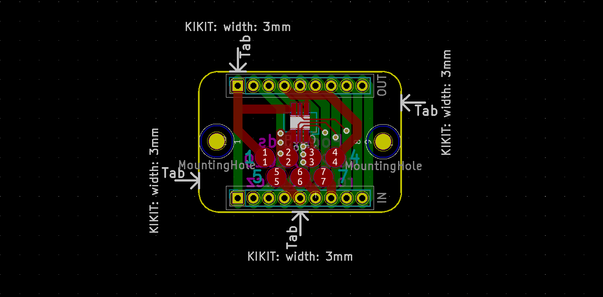

They specify where to place tabs. You can even specify individual tab width via
text property of the symbol. How to use it? Just specify tab type to
`annotation`. We also have to increase the source area tolerance, so it can
capture the annotations.

!!! example "Panelization command"

    === "Linux/macOS"
        ```
        kikit panelize \
            --layout 'grid; rows: 2; cols: 2; space: 5mm;' \
            --tabs annotation \
            --source 'tolerance: 15mm' \
            --cuts 'mousebites; drill: 0.5mm; spacing: 1mm; offset: 0.2mm; prolong: 0.5mm' \
            --framing 'railstb; width: 5mm; space: 3mm;' \
            --post 'millradius: 1mm' \
            docs/resources/conn.kicad_pcb panel.kicad_pcb
        ```

    === "Windows"
        ```
        kikit panelize ^
            --layout "grid; rows: 2; cols: 2; space: 5mm;" ^
            --tabs annotation ^
            --source "tolerance: 15mm" ^
            --cuts "mousebites; drill: 0.5mm; spacing: 1mm; offset: 0.2mm; prolong: 0.5mm" ^
            --framing "railstb; width: 5mm; space: 3mm;" ^
            --post "millradius: 1mm" ^
            docs/resources/conn.kicad_pcb panel.kicad_pcb
        ```

    

Well, the panel looks strange – right? That's because KiKit always constructs a
half-bridges. When you specify the tabs location, you have to either ensure they
match or put a piece of substrate they can reach – e.g., a backbone or a
tightframe. If you are interested in the details, read more about tabs in
section [Understanding tabs](tabs.md). Let's fix it:

!!! example "Panelization command"

    === "Linux/macOS"
        ```
        kikit panelize \
            --layout 'grid; rows: 2; cols: 2; space: 2mm; hbackbone: 3mm; vbackbone: 3mm' \
            --tabs annotation \
            --source 'tolerance: 15mm' \
            --cuts 'mousebites; drill: 0.5mm; spacing: 1mm; offset: 0.2mm; prolong: 0.5mm' \
            --framing 'railstb; width: 5mm; space: 3mm;' \
            --post 'millradius: 1mm' \
            docs/resources/conn.kicad_pcb panel.kicad_pcb
        ```

    === "Windows"
        ```
        kikit panelize ^
            --layout "grid; rows: 2; cols: 2; space: 2mm; hbackbone: 3mm; vbackbone: 3mm" ^
            --tabs annotation ^
            --source "tolerance: 15mm" ^
            --cuts "mousebites; drill: 0.5mm; spacing: 1mm; offset: 0.2mm; prolong: 0.5mm" ^
            --framing "railstb; width: 5mm; space: 3mm;" ^
            --post "millradius: 1mm" ^
            docs/resources/conn.kicad_pcb panel.kicad_pcb
        ```

    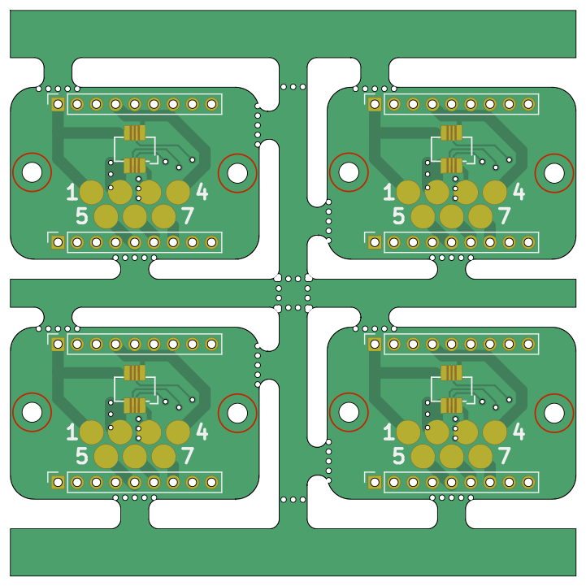

Note that the annotation can have an arbitrary orientation. The arrow just must
be outside board edge and points towards it. KiKit will also place only those
tabs, that have a neighboring substrate. For precise algorithm, see section
[understanding tabs](tabs.md).

When you make flex PCBs or you want to save etchant, it make sense to pour
copper on all non-functional parts of the panel. It will make the PCB rigid. You
can do so via `copperfill` section:

!!! example "Panelization command"

    === "Linux/macOS"
        ```
        kikit panelize \
            --layout 'grid; rows: 2; cols: 2; space: 2mm' \
            --tabs 'fixed; width: 3mm;' \
            --cuts 'mousebites; drill: 0.5mm; spacing: 1mm; offset: 0.2mm; prolong: 0.5mm' \
            --framing 'railstb; width: 5mm; space: 3mm;' \
            --copperfill solid \
            --post 'millradius: 1mm;' \
            docs/resources/conn.kicad_pcb panel.kicad_pcb
        ```

    === "Windows"
        ```
        kikit panelize ^
            --layout "grid; rows: 2; cols: 2; space: 2mm" ^
            --tabs "fixed; width: 3mm;" ^
            --cuts "mousebites; drill: 0.5mm; spacing: 1mm; offset: 0.2mm; prolong: 0.5mm" ^
            --framing "railstb; width: 5mm; space: 3mm;" ^
            --copperfill solid ^
            --post "millradius: 1mm;" ^
            docs/resources/conn.kicad_pcb panel.kicad_pcb
        ```

    

When you use V-cuts with `copperfill` you (or your fab house) might want to
include a clearance around the V-cuts:

!!! example "Panelization command"

    === "Linux/macOS"
        ```
        kikit panelize \
            --layout 'grid; rows: 2; cols: 2; space: 2mm' \
            --tabs 'fixed; hwidth: 10mm; vwidth: 15mm' \
            --cuts 'vcuts; clearance: 1.5mm' \
            --framing 'railstb; width: 5mm; space: 3mm;' \
            --copperfill solid \
            --post 'millradius: 1mm;' \
            docs/resources/conn.kicad_pcb panel.kicad_pcb
        ```

    === "Windows"
        ```
        kikit panelize ^
            --layout "grid; rows: 2; cols: 2; space: 2mm" ^
            --tabs "fixed; hwidth: 10mm; vwidth: 15mm" ^
            --cuts "vcuts; clearance: 1.5mm" ^
            --framing "railstb; width: 5mm; space: 3mm;" ^
            --copperfill solid ^
            --post "millradius: 1mm;" ^
            docs/resources/conn.kicad_pcb panel.kicad_pcb
        ```

    

If you, for example do not wish to cover the tabs with copper, you can also
specify clearance. Also, some manufacturers don't like when you have large solid
copper areas. In that case, you can use a hatch pattern to fill the area:

!!! example "Panelization command"

    === "Linux/macOS"
        ```
        kikit panelize \
            --layout 'grid; rows: 2; cols: 2; space: 2mm' \
            --tabs 'fixed; width: 3mm;' \
            --cuts 'mousebites; drill: 0.5mm; spacing: 1mm; offset: 0.2mm; prolong: 0.5mm' \
            --framing 'railstb; width: 5mm; space: 3mm;' \
            --copperfill 'hatched; clearance: 2mm; spacing: 0.5mm; width: 0.5mm' \
            --post 'millradius: 1mm;' \
            docs/resources/conn.kicad_pcb panel.kicad_pcb
        ```

    === "Windows"
        ```
        kikit panelize ^
            --layout "grid; rows: 2; cols: 2; space: 2mm" ^
            --tabs "fixed; width: 3mm;" ^
            --cuts "mousebites; drill: 0.5mm; spacing: 1mm; offset: 0.2mm; prolong: 0.5mm" ^
            --framing "railstb; width: 5mm; space: 3mm;" ^
            --copperfill "hatched; clearance: 2mm; spacing: 0.5mm; width: 0.5mm" ^
            --post "millradius: 1mm;" ^
            docs/resources/conn.kicad_pcb panel.kicad_pcb
        ```

    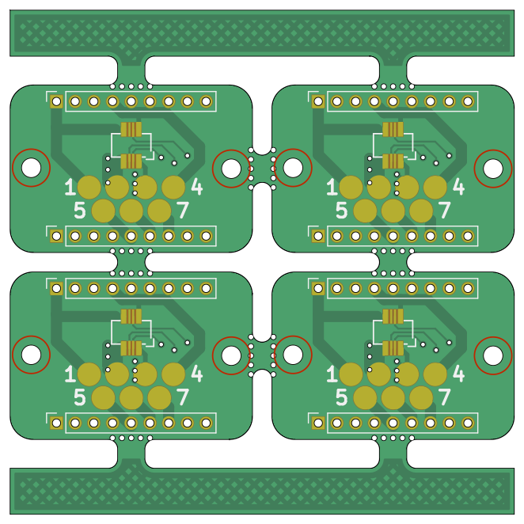

Note one last facts about V-cuts. V-cuts can only be straight and
horizontal/vertical. But you can use them with circular boards if you want by
cutting a little inside them. The option `cutcurves`, that will approximate the
cut by staring and ending point.

## I would like... but KiKit does not support it!

If you need something special; e.g., custom placement of tooling holes, multiple
texts, etc. KiKit has you covered.

The CLI interface allows you to run a custom script over the final panel. The
script can use KiKit Python interface to modify it. For the sake of simplicity,
let's add a hole in the middle of the frame. Therefore, we write the following
script:

```.py
from kikit.units import mm
from kikit.common import toKiCADPoint

def kikitPostprocess(panel, arg):
    minx, miny, maxx, maxy = panel.panelBBox()
    position = toKiCADPoint(((minx + maxx) // 2, miny + 2 * mm))
    panel.addNPTHole(position, 3 * mm)
```

Then run KiKit:

!!! example "Panelization command"

    === "Linux/macOS"
        ```
        kikit panelize \
            --layout 'grid; rows: 2; cols: 2; space: 2mm' \
            --tabs 'fixed; width: 3mm; vcount: 2' \
            --cuts 'mousebites; drill: 0.5mm; spacing: 1mm; offset: 0.2mm; prolong: 0.5mm' \
            --framing 'railstb; width: 5mm; space: 3mm;' \
            --post 'millradius: 1mm; script: docs/resources/examplePost.py' \
            docs/resources/conn.kicad_pcb panel.kicad_pcb
        ```

    === "Windows"
        ```
        kikit panelize ^
            --layout "grid; rows: 2; cols: 2; space: 2mm" ^
            --tabs "fixed; width: 3mm; vcount: 2" ^
            --cuts "mousebites; drill: 0.5mm; spacing: 1mm; offset: 0.2mm; prolong: 0.5mm" ^
            --framing "railstb; width: 5mm; space: 3mm;" ^
            --post "millradius: 1mm; script: docs/resources/examplePost.py" ^
            docs/resources/conn.kicad_pcb panel.kicad_pcb
        ```

    

You can learn more about available functions from the comment in the source code
or in the [Python API reference](python_api.md). The basic concepts are
summarized in the [scripting guide](scripting.md).

If you implement a feature that your fab house requires (e.g., new tooling hole
type), consider submitting a pull request for KiKit instead. I believe the
others will benefit from it.

## Managing presets

The last section of this document is dedicated to management of presets. You can
read the specification in the [documentation for CLI](cli.md). Here I would like
to focus on practical examples.

As you should know from the documentation, the panelization preset is divided
into sections; e. g., `layout`, `tabs`, etc. The key-value parameters in these
sections can be specified via JSON files. In KiKit, you can specify these files
via `-p` option:

``` kikit panelize -p myPreset.json -p :<builtInPreset> <other parameters> ```

The parameters in the later specified presets override the parameters in the
previously specified presets. This allows you to define a named piece-wise
presets. Therefore, you can prepare various presets for mousebites – e.g.,
`fineMousebites.json` and `coarseMousebites.json`:

```.js
// fineMousebites.json
{
    "cuts": {
        "type": "mousebites", "drill": "0.5mm", "spacing": "0.9mm", "offset":
        "0.25mm"
    }
}

// coarseMousebites.json
{
    "cuts": {
        "type": "mousebites", "drill": "0.3mm", "spacing": "0.2mm", "offset":
        "0.15mm"
    }
}
```

Then you can specify your panelization commands easily via:

``` kikit panelize -p fineMousebites.json <otheroptions> ```

Therefore, you can build a custom library of commonly used-options; e.g., per
fabrication house. KiKit offers some built-in presets – see
[`panelizePresets`](https://github.com/yaqwsx/KiKit/tree/master/kikit/resources/panelizePresets).
Note that the built-in preset `default.json` is always used as a base and it
specifies conservative default values so you can only override the options
relevant for you.

To give you an example – with KiKit, you will no longer have to remember what
diameter of tooling holes JLC PCB requires, just use:

``` kikit panelize -p :jlcTooling <otheroptions> ```

