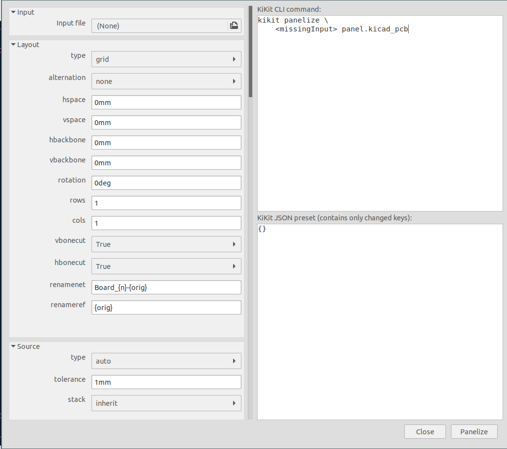

# Panelization GUI

The panelization feature of KiKit is also available via GUI in the KiCAD's PCB
editor (Pcbnew). The main use-case for the GUI is to quickly construct the
desired KiKit command and fine-tune the panel. It also serves as a quick help in
case you are not sure about parameter naming.

The GUI is designed to be run in a standalone instance of Pcbnew (not executed
from a project) as the generated panel replaces the currently open board.

You can invoke the GUI via clicking on the panelization icon:

Then the following window will open:

There are three parts of the window:

- the left column where you can edit individual parameter sections. These
  sections are in 1:1 correspondence to the panelization CLI. For the help on
  their meaning please refer to [CLI documentation](cli.md)
- the right column with:
    - the constructed KiKit command (that you can put into your Makefile)
    - the constructed JSON preset that you can save and later use.

Note that both, the command and JSON preset, does not include a parameter if it
is the same with the default, built-in, preset.

Once you are happy with the parameters, you can click the "Panelize" button and
the panel will appear in the Pcbnew work area. You can then edit the parameters
and regenerate the panel. The panel you see in the Pcbnew window is only a
preview. The panel is automatically saved to the specified location upon
creation.
