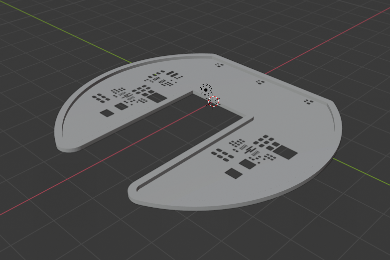
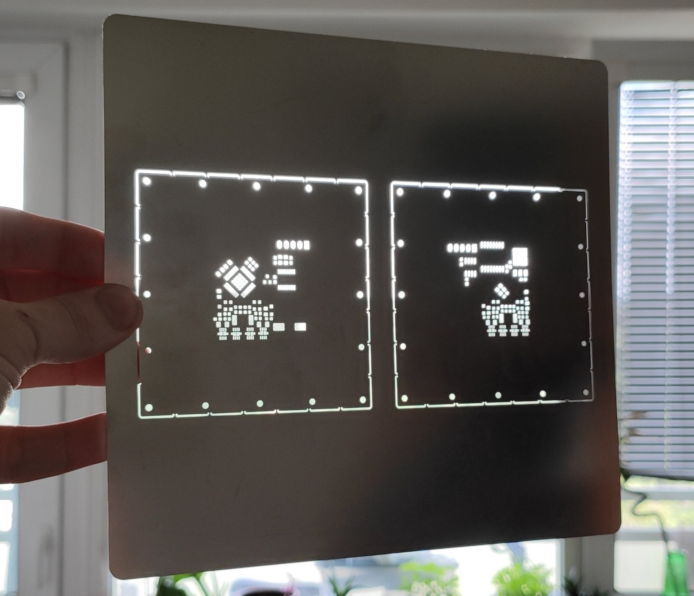

# Exporting Solder Paste Stencils

If you populate your boards using a reflow oven, you often need solder paste
stencils. One of the inconveniences with stencils is that  you have to align
them manually. It is not hard, but it takes some time and a little bit of
practice & tricks (e.g. to use other PCBs for stencil alignment).

KiKit provides two ways to generate stencils:

- a 3D self-registering model of a stencil you can easily print on SLA printer,
- files for manufacturing steel stencils in a fabrication house with 3D printed
  aligning jig.

## Special Options For Both Types of Stencils

KiKit allows you to ignore components from the stencil by specifying `--ignore`
followed by a comma separated list of components' references to exclude. Pads of
these components will not appear in the stencil. This is useful, when you do not
want to populate all components.

The second common option is `--cutout` followed by a comma separated lists of
components' references. For these components, the stencil will contain a cutout
based on the component courtyard. This is useful when you have already
pre-populated board and you want to populate more components -- e.g., when your
assembly house does not have a special IC and you populate it yourself and also,
when you do a board repair.

## 3D Printed Stencils

I wrote [a blog post about the 3D printed self-registering
stencils](https://blog.honzamrazek.cz/2020/01/printing-solder-paste-stencils-on-an-sla-printer/)
on my blog. These stencils are quick solution when you urgently need a stencil
but probably they don't last long and might come with imperfections.




To generate such stencil, just call:
```
kikit stencil createprinted [parameters] <boardFile> <outputDirectory>
```
where parameters is one of the following:
```
--pcbthickness FLOAT    PCB thickness in mm
--thickness FLOAT       Stencil thickness in mm. Defines amount of paste
                        dispensed
--framewidth FLOAT      Register frame width
--ignore TEXT           Comma separated list of components references to
                        exclude from the stencil
--frameclearance FLOAT  Clearance for the stencil register in milimeters
--enlargeholes FLOAT    Enlarge pad holes by x mm
```

KiKit will output two STL files representing bottom and top register to the
specified directory. You can directly print these files. In theory, if you don't
have small pads spacing, you could print them even on FDM machine, but I haven't
tested it.

## Steel Stencils

Many fabhouses offer you to create a custom stencil. However, it is pain to
align them. Therefore, KiKit offers a functionality to automatically generate
stencils which fit a simple 3D printed or lasercut alignment jig.

The jig is available as [Fusion 360 model](resources/jig.f3d),
[STEP](resources/jig.step) or [3MF](resources/jig.3mf).It it designed to be cut
from 3mm thick acrylic but you can also print it. You need 4 2mm pins, 8 M2
screws and that's it. The frame can be customized - there two parameters of the
model, `frameWidth` and `frameHeight` which define the largest PCB it can
accept. I usually use 100x100mm and 60x60mm.

Then you issue the following command within KiKit:
```
kikit stencil create  --jigsize 60 60 <boardFile> <outputDir>
```
Note that there are more options for this command, see output of `kikit stencil
create --help`.

KiKit will produce 2 STL files for aligning the PCB and a zip file with gerbers
for the manufacturer. When you order your stencil, let them make both top and
bottom side on the same stencil. One tip for JLC PCB: set custom size of the
stencil when you order it - then it fits into your package with your PCB and you
don't have to pay for extra shipping.

The stencil you receive should look like on the following picture. It has mouse
bites so you can easily break it off to precise size. It also has mounting
holes.



Once you break the stencils off, you mount them in the jig frame:


Then you print alignment parts for your board and mount in onto the jig using M2
screws:


Then you just use 2mm pins to align the frame and you can apply the paste!


The acrylic jig is reusable - you just have to mount new alignment pieces and
change the stencil.
